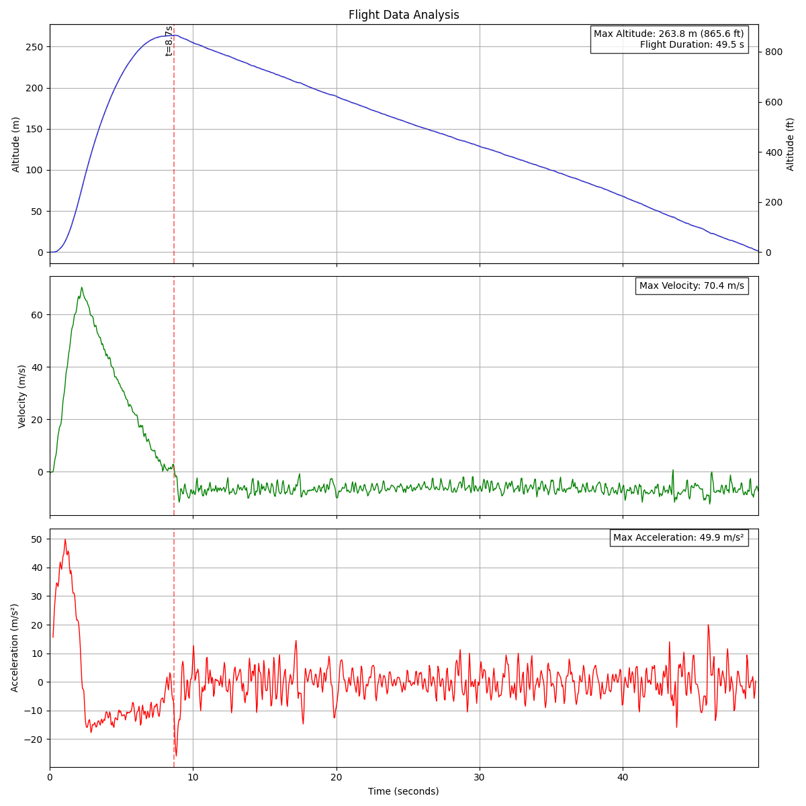

# Flight Data Recorder

A high-precision flight data recorder system designed for model rockets. The system records altitude, pressure, and temperature data using a BMP390 sensor and stores it on an SD card. It includes a Python script for analyzing and visualizing the flight data.

## Features

- Records altitude, pressure, and temperature data at 20Hz (every 50ms)
- Automatic file naming with sequential numbering
- Status indication via RGB LED
- Data stored in CSV format for easy analysis
- Python analysis script providing:
  - Altitude plots (meters and feet)
  - Velocity calculation and plotting
  - Acceleration calculation and plotting
  - Automatic flight phase detection
  - Key statistics (max altitude, velocity, acceleration, flight duration)

## Hardware Requirements

- SparkFun Thing Plus - ESP32-S3
- BMP390 pressure sensor with Qwiic connector
- SD card module (SDIO interface)
- Appropriate power supply (LiPo Battery 300mAH)

### Pin Connections

#### SDIO Interface
- CLK: Pin 38
- CMD: Pin 34
- D0: Pin 39
- D1: Pin 40
- D2: Pin 47
- D3: Pin 33

#### Other Connections
- RGB LED: Pin 46
- BMP390: Connected via Qwiic I2C connector (no additional wiring needed)

## Software Setup

### Arduino Setup

1. Install the following libraries in Arduino IDE:
   - Adafruit BMP3XX Library
   - Adafruit Sensor
   - FastLED
   - SD_MMC (included with ESP32 board support)

2. Upload the `FlightDataRecorder.ino` sketch to your ESP32 board

### Python Setup

1. Install required Python packages:
```bash
pip install pandas matplotlib numpy
```

## Usage

### Recording Data

1. Power on the device
2. The RGB LED will indicate status:
   - Red: Initialization or error
   - Green: Ready and recording

The device will automatically create numbered files in the format `flight_XXXXX.csv` on the SD card.

### Analyzing Data

To analyze the recorded flight data:

```bash
python plot_flight.py path/to/flight_XXXXX.csv
```

This will generate a PNG file with three plots:
1. Altitude (meters and feet)
2. Velocity (m/s)
3. Acceleration (m/s²)

The analysis includes:
- Automatic ground level calibration
- Flight phase detection
- Key statistics display
- Smoothed acceleration data

## Output Format

The CSV files contain the following columns:
- Timestamp (milliseconds)
- Altitude (meters)
- Pressure (hPa)
- Temperature (°C)

## Example Output

Below is an example flight data analysis showing altitude, velocity, and acceleration plots:



*Example flight showing a model rocket launch reaching approximately 100m altitude with flight phases clearly visible in all three measurements.*

## Troubleshooting

- If the LED stays red during initialization:
  - Check BMP390 sensor connections
  - Verify SD card is properly inserted
  - Ensure SD card is formatted correctly
- If no data is being recorded:
  - Check SD card write permissions
  - Verify sensor readings in Serial Monitor